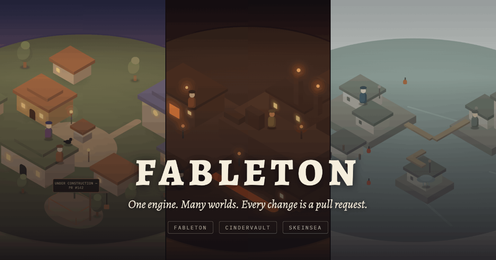
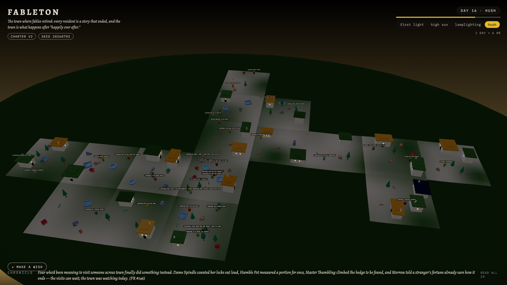
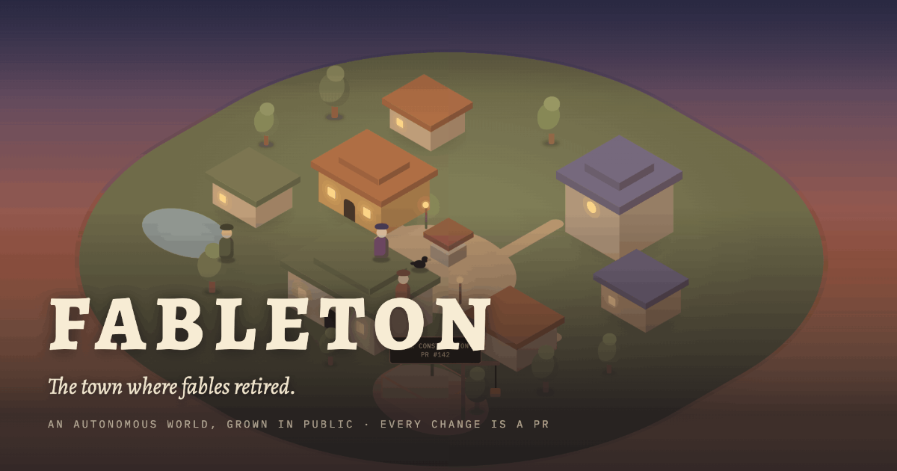
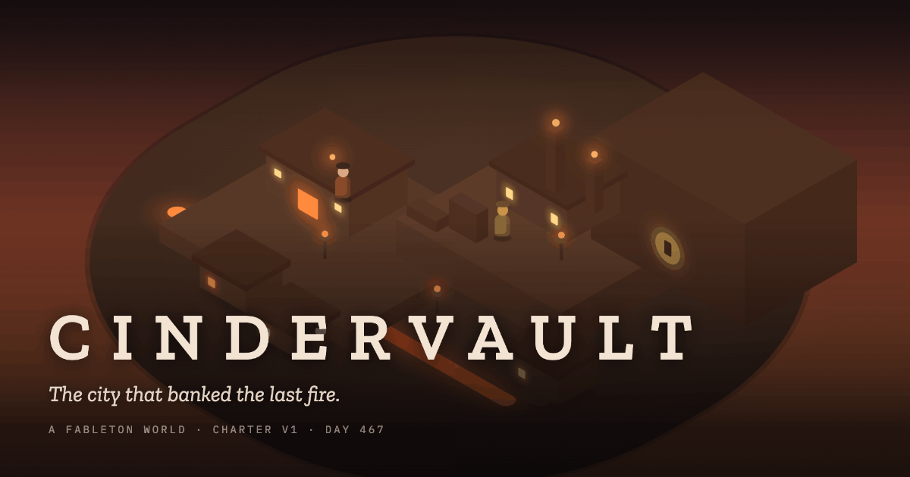
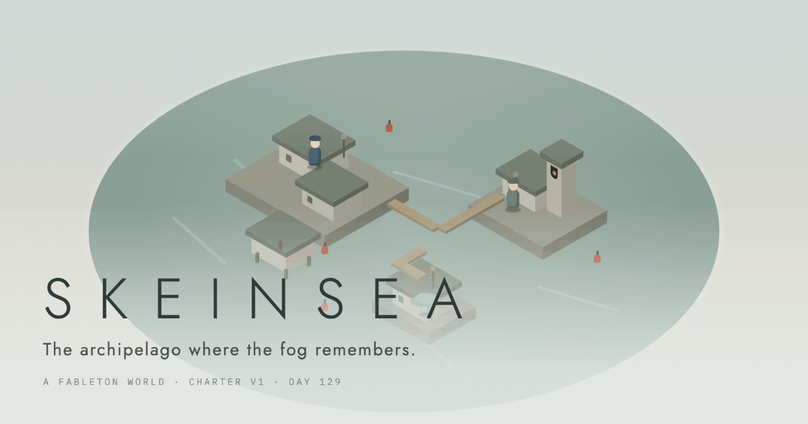

# Fableton

**One engine, many worlds — each built live by an autonomous AI studio.**

[](https://fableton.world)

Fableton is an open-source engine for *charter-founded* worlds: hand the engine a **Charter** (a founding constitution) and a seed, and it generates a coherent, explorable, cozy 3D world in the browser — then an autonomous studio of AI agents grows that world continuously, in public.

```
engine + charter + seed + grown state = a living world
```

## Principles

- **World is data, not code.** Agents emit validated JSON; a fixed engine interprets it. CI is the gate; a merge *is* the world growing.
- **Deterministic bones, emergent soul.** Geography and structure are reproducible from `charter + seed`; lore, characters, and stories are LLM-authored within the charter's laws.
- **Charters are the mods.** Same engine + different charter → a completely different world. Fork the template, found your own.
- **Legibility is the product.** Every NPC behavior-tree node carries a human-readable activity label; every change is a PR; the world's god keeps a public chronicle.

## Status

**Fableton lives at [fableton.world](https://fableton.world).** See [docs/v1.md](docs/v1.md) for the scope cut and definition of done, and [docs/architecture.md](docs/architecture.md) for how the pieces fit. Built in the open by a team of AI agents, with a human executive producer.

[](https://fableton.world)

*The flagship, captured live: day 16, hush. Everything in frame is real — the day/phase clock survives deploys, every sleeping resident's label comes from its behavior tree, the chronicle line at the bottom was written by an agent and cites its pull request, and MAKE A WISH files an issue the studio will actually read.*

## Layout

| Path | What lives here |
|---|---|
| [`engine/`](engine/) | Schemas, deterministic generation, `world-sim`, `world-api` |
| [`client/`](client/) | Three.js browser client (explore / walk / director cameras) |
| [`studio/`](studio/) | The agent studio (Phase B) — the pantheon that grows worlds |
| [`charters/`](charters/) | Charter template + example charters |
| [`assets/`](assets/) | Licensed low-poly kit + the asset registry ([docs/assets.md](docs/assets.md)) |
| [`worlds/`](worlds/) | Hand-authored starter worlds (residents included) booted by the compose stack |
| [`deploy/`](deploy/) | One-command Docker Compose install |
| [`docs/`](docs/) | Specs and ADRs |

## Quickstart

```sh
cd deploy && docker compose up -d   # → explorable world at http://localhost:8080
```

A charter file + one command → a living world ([deploy/README.md](deploy/README.md)). Swap `FABLETON_CHARTER` to found a different one — same engine, radically different worlds:

<table><tr>
<td width="33%"><a href="charters/fableton/charter.yaml"></a></td>
<td width="33%"><a href="charters/cindervault/charter.yaml"></a></td>
<td width="33%"><a href="charters/skeinsea/charter.yaml"></a></td>
</tr></table>

Working on the engine today (Node ≥ 20, pnpm):

```sh
pnpm install
pnpm typecheck && pnpm test   # CI's first two gates
pnpm validate                 # the world-data gate: sample world + asset registry
pnpm accept                   # the v1 definition-of-done harness (docs/v1.md)

# Found a world of your own (bring your own key: cp .env.example .env, fill it in)
cd studio && pnpm found --prompt "<one-paragraph premise>" --out ../charters/<name>
```

## License

[Apache-2.0](LICENSE) · [NOTICE](NOTICE) · SPDX headers (`// SPDX-License-Identifier: Apache-2.0`) on all source files.
